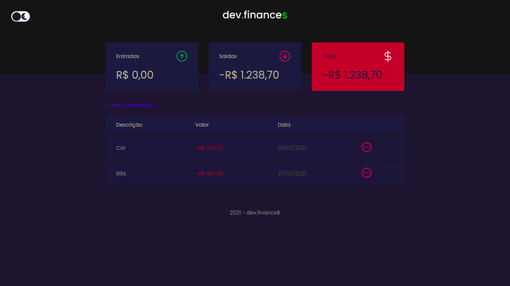
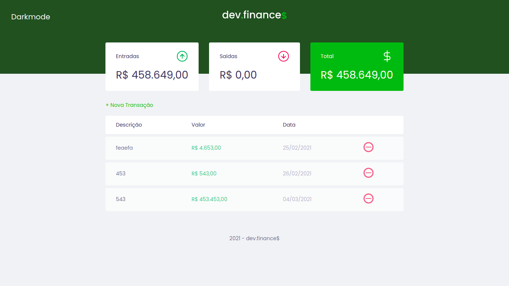
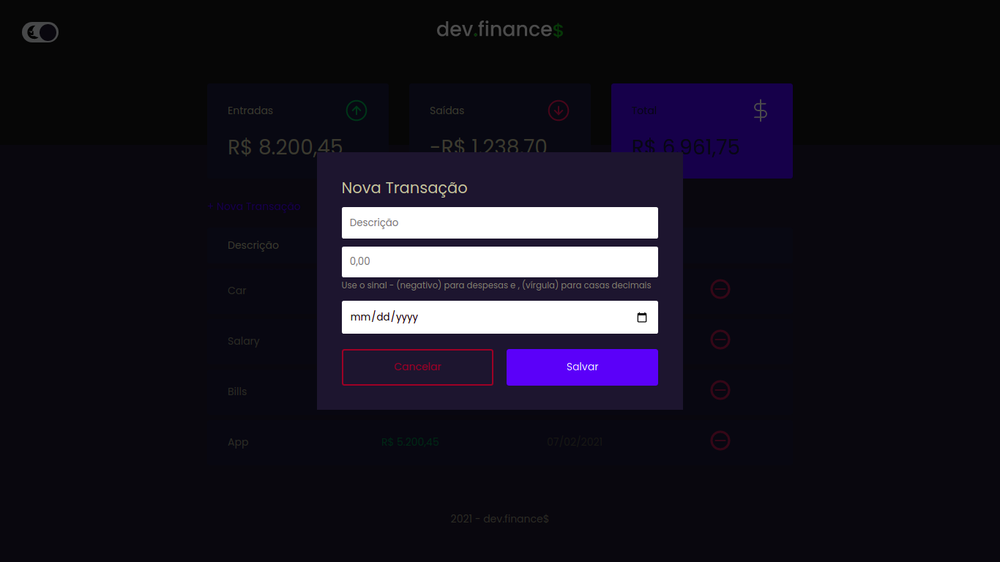
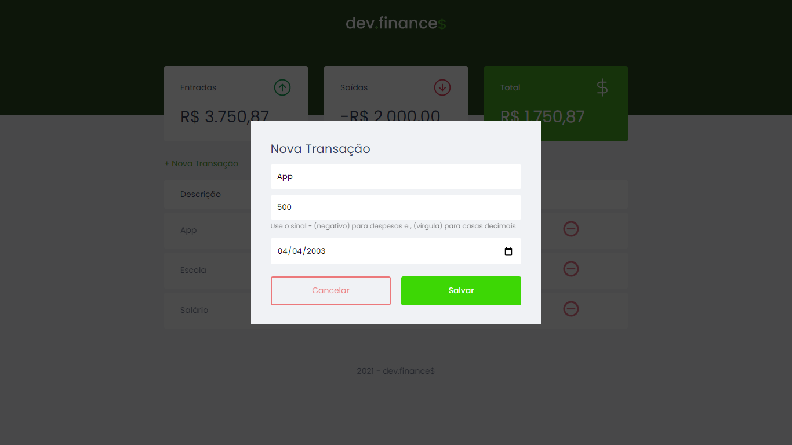

<p align="center">
  <h3 align="center">Dev Finances</h3>

  <p align="center">
    A simple website that takes care of finances!
    <br />
    <a href="https://github.com/LucFerSan/dev-finances-discover"><strong>Explore the docs »</strong></a>
    <br />
    <br />
    ·
    <a href="https://github.com/LucFerSan/dev-finances-discover/issues">Report Bug</a>
    ·
    <a href="https://github.com/LucFerSan/dev-finances-discover/issues">Request Feature</a>
  </p>
</p>

## About The Project



A responsive website, in which you can control incomes and expenses visually.

### Built With

- [Html](https://developer.mozilla.org/pt-BR/docs/Web/HTML)
- [Css](https://developer.mozilla.org/pt-BR/docs/Web/CSS)
- [Javascript](https://developer.mozilla.org/pt-BR/docs/Web/JavaScript)

### Installation

1. Clone the repo
   ```sh
   git clone https://github.com/LucFerSan/dev-finances-discover.git
   ```

## Usage

<p float="left">
  
   
</p>

<p float="left">
  
   
</p>

## Contributing

Contributions are what make the open source community such an amazing place to be learn, inspire, and create. Any contributions you make are **greatly appreciated**.

1. Fork the Project
2. Create your Feature Branch (`git checkout -b feature/AmazingFeature`)
3. Commit your Changes (`git commit -m 'Add some AmazingFeature'`)
4. Push to the Branch (`git push origin feature/AmazingFeature`)
5. Open a Pull Request

## License

Distributed under the MIT License. See `LICENSE` for more information.

## Contact

Lucas Fernandes - fernandes.lucas11@outlook.com

Project Link: [https://github.com/LucFerSan/dev-finances-discover](https://github.com/LucFerSan/dev-finances-discover)

### Special thanks to

- [Mayk Brito](https://github.com/maykbrito)
- [Rocketseat](https://github.com/Rocketseat)
